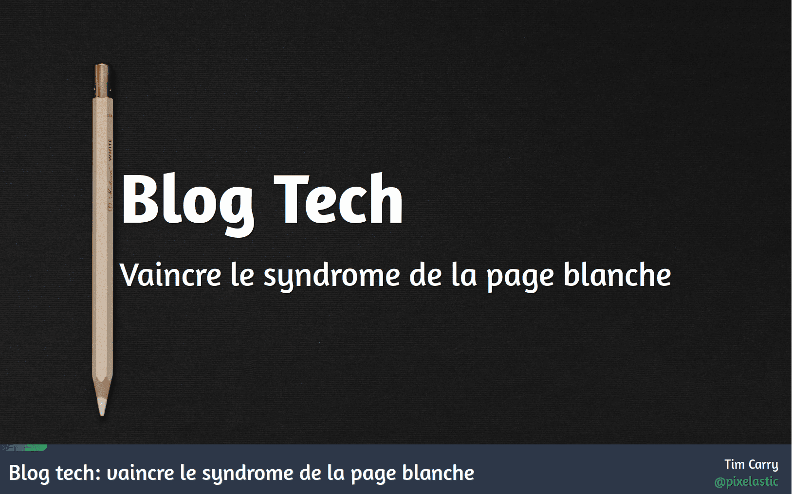

# Blog tech: vaincre le syndrome de la page blanche

Talk donné au [ParisJS #97](https://www.meetup.com/paris-js/events/284673204/) en mars 2022.

## Liens

- [Slides](https://talks.pixelastic.com/slides/parisjs-blog/)
- [Vidéo](https://www.youtube.com/watch?v=CVrj7ioaGnI)

## Description

Un talk sur les techniques pour aider les développeurs à vaincre le syndrome de la page blanche et écrire de meilleurs articles techniques, couvrant :
- Création : Générer et organiser ses idées
- Narration : Structurer le contenu avec la structure en trois actes
- Édition : Affiner et améliorer son écriture

